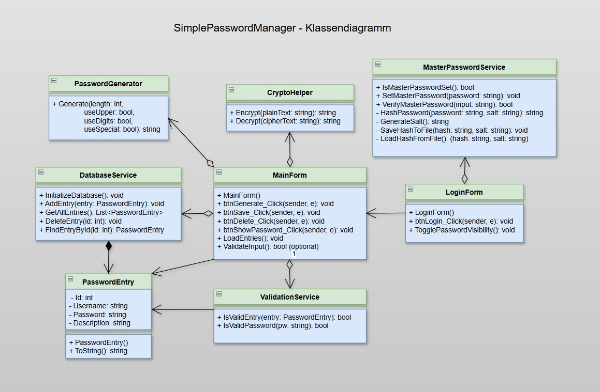

# SimplePasswordManager

Ein einfacher Passwortmanager in C# mit WinForms und SQLite.

## Features

- Passwortgenerator mit einstellbarer Länge und Komplexität
- Speichern und Anzeigen von Passwörtern
- Datenbank (SQLite) zur sicheren Speicherung
- Einfache Oberfläche

## Mockup

## Klassendiagramm

