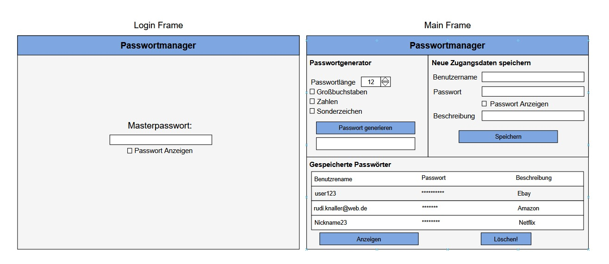
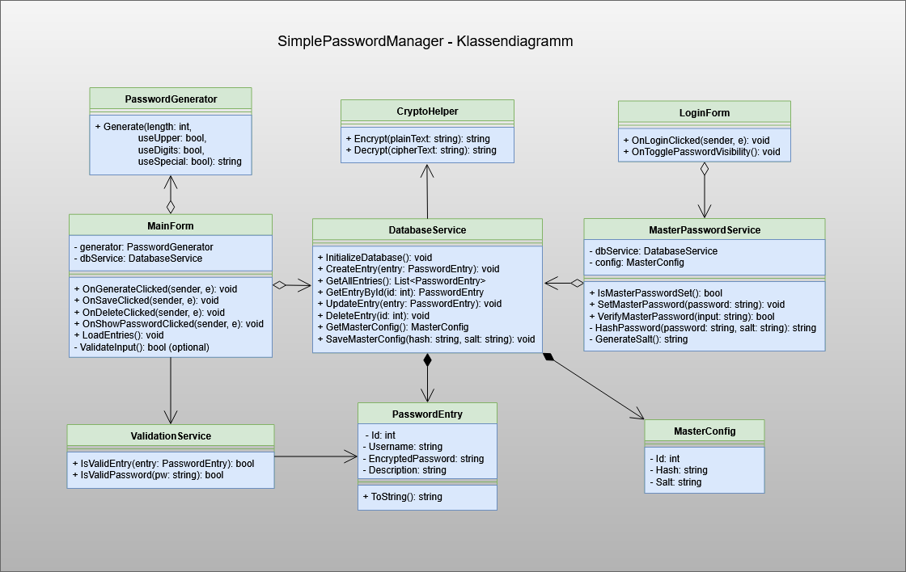

# 🔐 SimplePasswordManager

Ein einfacher, lokal laufender Passwortmanager in C# (.NET 6) mit WinForms und SQLite
(Datenbankanbindung mit Entity Framework Core, GUI-Entwicklung, Verschlüsselung)

---

📄 **[👉 Zur Projektdokumentation (PDF)](docs/Dokumentation/Dokumentation_SimplePasswordManager.pdf)**
  


---

## ✨ Features

- 💬 **Einfaches Login mit Masterpasswort**
- 🧠 **Passwortgenerator** mit einstellbarer Länge und Zeichenauswahl (Zahlen, Sonderzeichen, Groß-/Kleinbuchstaben)
- 🔒 **AES-256-Verschlüsselung** mit Salt, PBKDF2 und Initialisierungsvektor (IV)
- 💾 **Lokale Speicherung mit SQLite** (via Entity Framework Core)
- 🧪 **Unit-Tests mit xUnit** für zentrale Logik
- 🖥️ **Benutzeroberfläche mit Windows Forms** – intuitive GUI für Passwortverwaltung
- ✅ **Passwortvalidierung** und sichere Eingabekontrolle

---

## 📷 Mockup

Vorschau der Anwendung:



---

## 🧩 Klassendiagramm

UML-Diagramm der wichtigsten Klassenstrukturen:



---

## 🚀 Technologien

| Komponente           | Beschreibung                                                |
|----------------------|-------------------------------------------------------------|
| **C# (.NET 6)**       | Moderne objektorientierte Programmiersprache                |
| **WinForms**          | GUI-Framework für klassische Windows-Desktopanwendungen     |
| **SQLite**            | Leichtgewichtiges, dateibasiertes Datenbanksystem           |
| **Entity Framework Core** | ORM für Datenbankzugriff mit LINQ & DbContext         |
| **xUnit**             | Test-Framework für Unit-Tests                               |
| **AES / PBKDF2**      | Industriestandard für Verschlüsselung und Schlüsselableitung |

---

## 🛠️ Setup & Nutzung

1. **Projekt klonen**
   ```bash
   git clone https://github.com/dein-nutzername/SimplePasswordManager.git